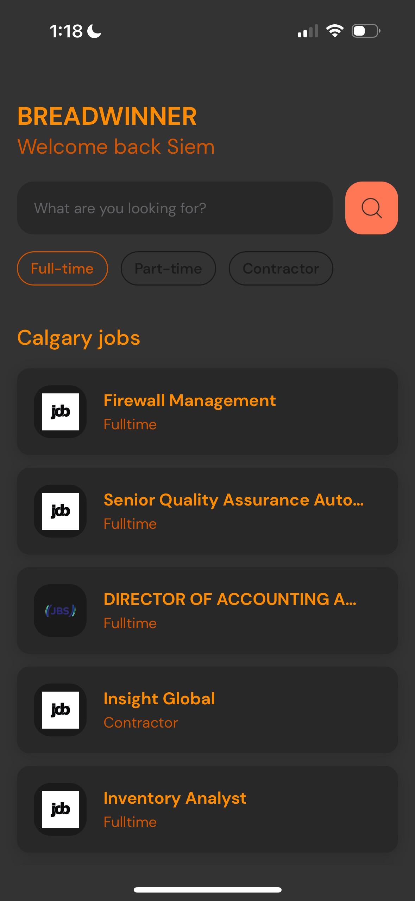
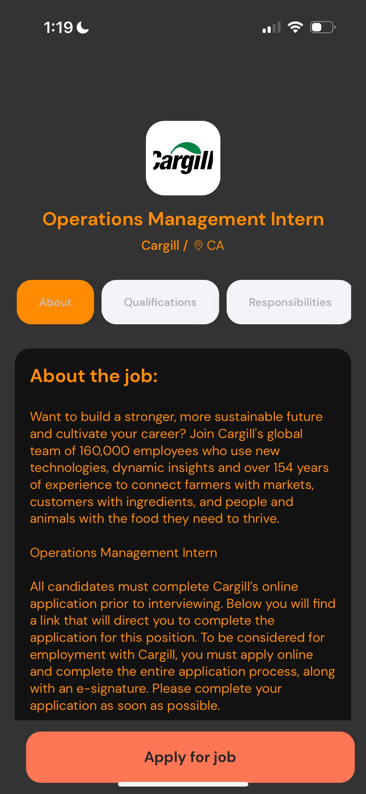
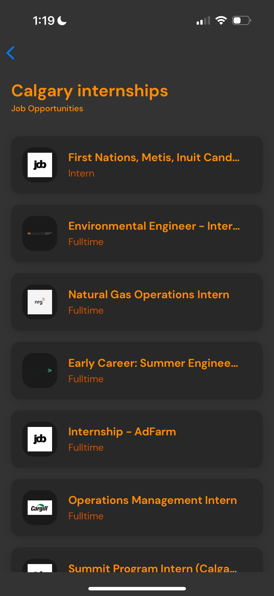
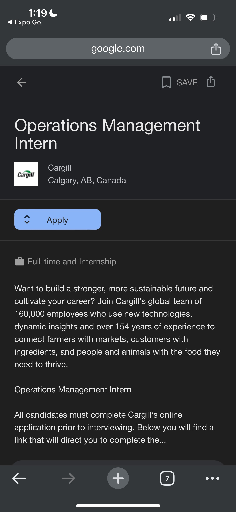

# Breadwinner 🍞 - Your Gateway to Employment Opportunities

This is a mobile app made to streamline your job search process. Built with React Native and Expo Go, this app leverages the JSearch API to provide you with real-time, curated job listings tailored to your search criteria. It collects job opportunities from multiple sources such as LinkedIn, Indeed, etc. and puts them into one place for you.

## Features 🚀

- **Personalized Job Search**: Users can effortlessly browse through a variety of job listings, including full-time positions, part-time gigs, and contractor opportunities. Whether you're in Calgary or elsewhere, Breadwinner is your partner in the job search journey. You can search by location or any other filter you want to use.

- **Job Details at a Glance**: With a simple tap, users can view detailed information about each job, such as company profiles, job responsibilities, and application deadlines.

- **User-Friendly Interface**: Enjoy a sleek, dark-themed interface with orange accents that ensure readability and ease of navigation. (Area for improvement lol)

- **Expo Go Integration**: Test and run the app instantly on your device using Expo Go, providing a seamless development and preview experience.

## Technologies Used 💻

- **React Native**: For building a cross-platform mobile application that runs on both Android and iOS. This app is also build in JavaScript.
- **Expo Go**: To accelerate development with an on-the-go testing environment.
- **JSearch API**: Powering the app with a wide range of job listings from various sources.
- **Expo Router & Custom Hook**: This app also makes use of the Expo Router and a custom hook to fetch data.

## Installation 🛠️

To run Breadwinner on your local machine, follow these steps:

1. Clone the repository to your local machine.
2. Navigate to the project directory and run `npm install` to install all the necessary dependencies.
3. Obtain a free JSearch API key online and store it in a .env file in the root directory as "EXPO_PUBLIC_RAPID_API_KEY=api_key".
4. Start the development server by running `npm start`.
5. Open the Expo Go app on your mobile device and scan the QR code provided in your terminal.

Make sure you have `node`, `npm`, and `expo-cli` installed globally on your system before proceeding with the installation steps.

## Usage 📱

Once you've launched Breadwinner on your device:

1. Start by typing in the job title or keyword in the search bar.
2. Select the job type filter you prefer (full-time, part-time, or contractor).
3. Browse through the list of available jobs in your chosen category.
4. Tap on a job to view more details and click apply if it is a good fit.

## Screenshots 📸

### Home Screen

### Job Details

### Search Results for "Calgary Internships"

### After You Hit Apply

